---

theme: sky
revealOptions:
    slideNumber: true

---

# Git

Mario Antonioletti (mario@epcc.ed.ac.uk)


Note: To run:
```
npm install -g reveal-md. # If it requires installing (assumes npm is installed)
reveal-md ./git-slides.md
```
The default markdown-md keyboard shortcuts are:

* Up, Down, Left, Right: Navigation
* f: Full-screen
* s: Show slide notes
* o: Toggle overview
* . (Period or b: Turn screen black
* Esc: Escape from full-screen, or toggle overview

---

### Scenario


<small>
From: http://www.phdcomics.com/comics/archive.php?comicid=1531
</small>

----

### More working scenarios

* Want to work on files across different systems
   * e.g. home PC, your laptop, work PC, Eddie, ...
   * How do you keep files synchronized?
* Want to know the provenance of your files
   * Need to check previous code version
   * Who did what/when?
* Back-up precious files
   * Laptop stolen/disk fails/recover deleted files
* You want to be able to collaborate


----

### Version control can help!

* Also known as  *revision control* or *source control*
  * There are others: SVN, mercurial, ...
* Records &  preserves history of changes to files
* Not just for source code:
  * Configuration files
  * Parameter sets
  * Data files (git lfs for large files)
  * User documentation & manuals
  * Conference/journal papers/book chapters

----

### With version control you can...

* Keep track of changes
   * Lab notebook for code/documents
* Roll back to points in the change history
* Back up history of changes to various locations
* Work on files from multiple locations/systems
* Identify and resolve conflicts
   * Same file edited in the same place by more than one user
* Collaborate on code/documents/other files

---

### What we will cover ...

1. Tracking changes with a local repository

2. Working with a remote repository

3. Collaborating with colleagues using a repository

4. A little on branching

----

### You can get dedicated git GUIs

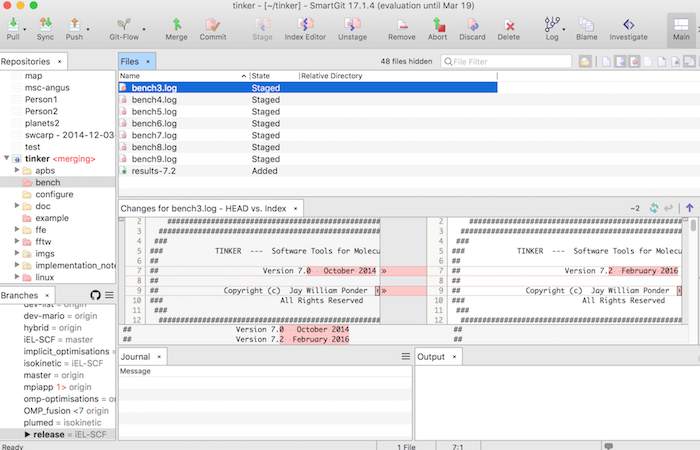
<small>
SmartGit (https://www.syntevo.com/smartgit/),free for non-commercial use.</small>


----

### Or as part of an IDE

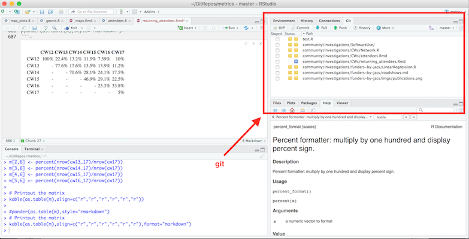
<small>
Rstudio (https://www.rstudio.com/)
</small>

* But we will use git from the shell

----

### Why use the shell ?

* All IDEs/GUIs use shell commands
* GUI may not be available remotely
* You can still use a GUI locally
   * Use git on remote machine
* But you have a choice
   * Easier: command line -> GUI

---

###  Initiatialise local repository

1. Tell git who you are (only once):
    * email address 
	* your name
2. Initialise a repository (only do once).
3. You **add** files to your local repository
4. Files are then in one of the following states:
    * **untracked** - repo does not know them
    * **tracked** - you have *add*ed them
       * **unmodified** - tracked file not changed 
       * **modified** -  tracked files changed
    * **staged** - about to add to the repository

----

### States

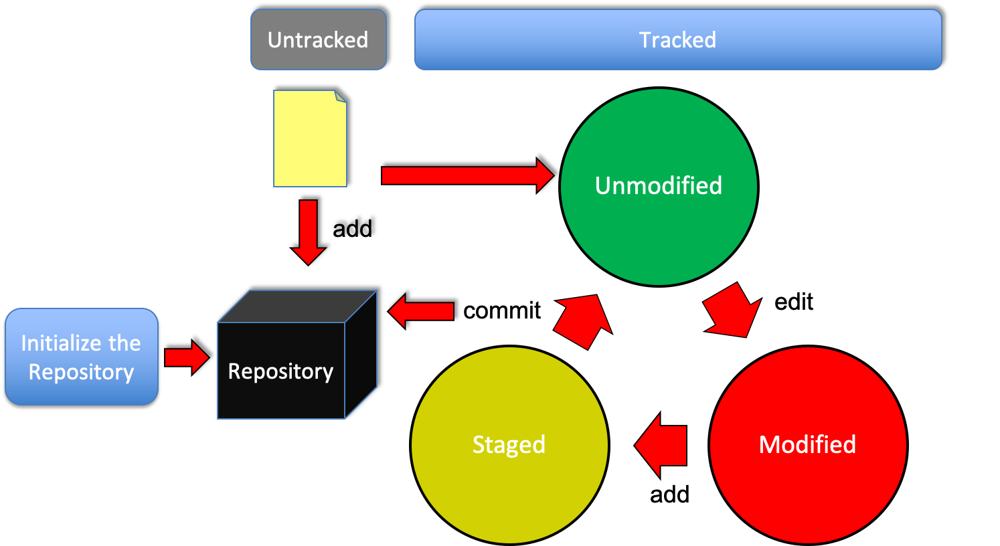

----
## FAIR Data/Software

Observing these will make you a better researcher:

* **F**indable, e.g. use DOIs and registries
* **A**ccessible, e.g. use open non-propretioritary formats to access software/data.
* **I**nteroperable,
* **R**eusable, think of reproducible

Using repositories take you  a long way (but not all). For more details see [Towards FAIR principles for research software](https://content.iospress.com/articles/data-science/ds190026) or these [slides](https://fair-software.nl/).

----
## Let's start ...

---

## Setting up remote repositories

----

### Service Providers


* *University GitLab* (https://git.ecdf.ed.ac.uk/)
* *GitHub* (https://github.com)
* *Bitbucket* (http://bitbucket.org)
* *GitLab* (https://about.gitlab.com)
* *Launchpad* (https://launchpad.net)
* *SourceForge* (http://sourceforge.net)
* ….

For more options see: https://git.wiki.kernel.org/index.php/GitHosting

---

# GitLab

----

## Sign in to University GitLab

* Go to https://git.ecdf.ed.ac.uk
* Sign in with your EASE credentials

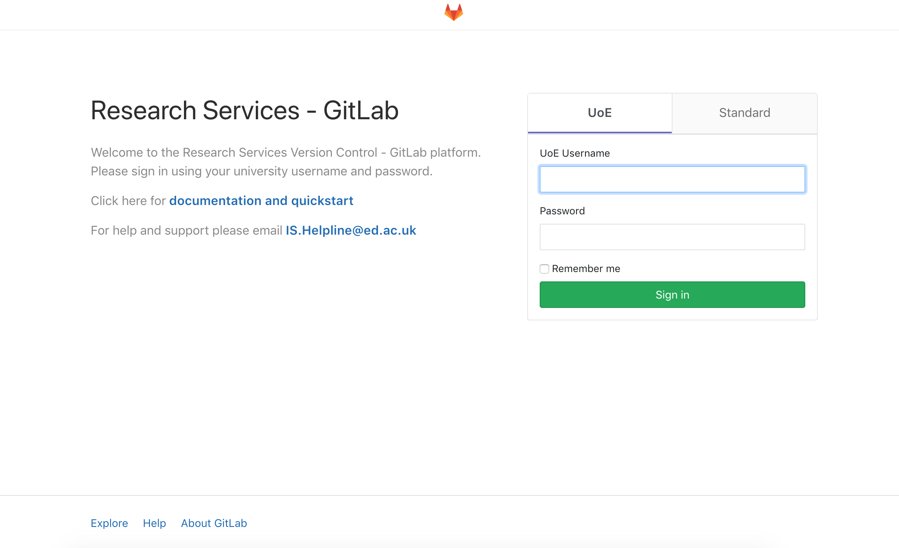

----

## Create a new project (1)

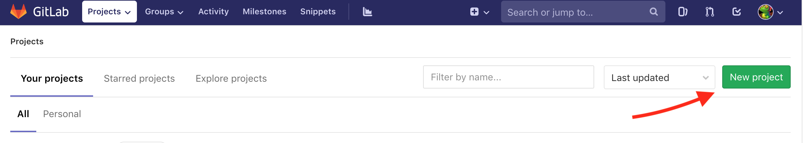

----

## Create a new project (2)

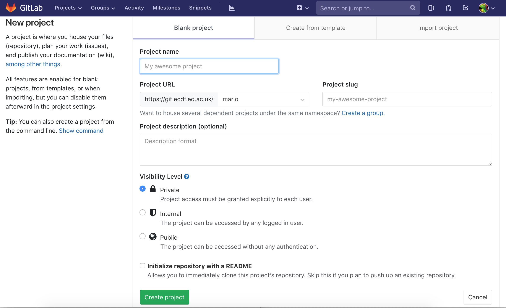

----

## Create a new project (3)

* Provides you with information on what to do.
* Let's try it out...

---

# GitHub

----

### Create new account on GitHub (1)

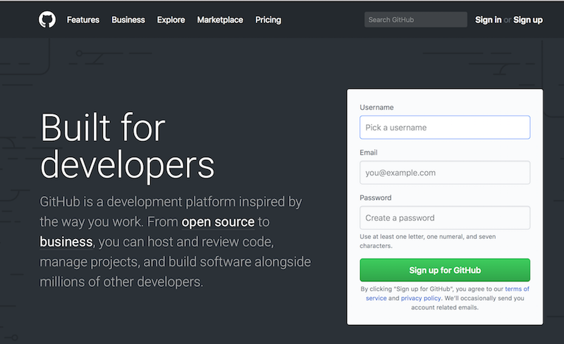

----

### Create new account on GitHub (2)

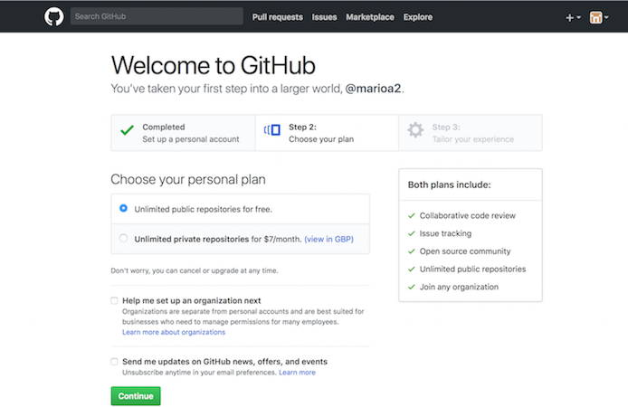

Verify Your email address


----

### Create a new repository

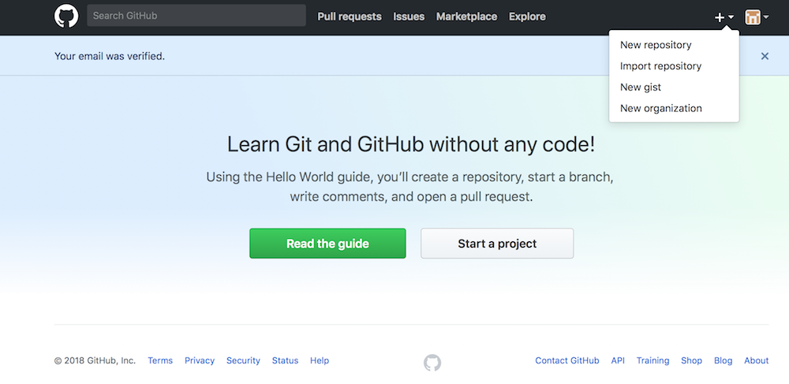


---

## Branching

----

## What is this master thing?

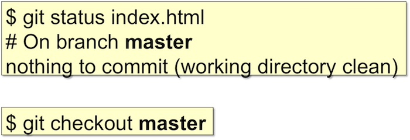

----

## Why branch?

* Start with your first commit:


----

### Add another commit


----

### Code ready, tag and release


----

### Branch at the release point

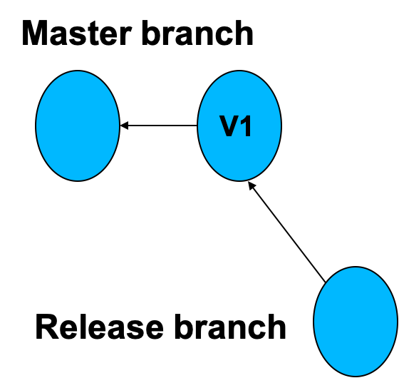

----

### Continue development

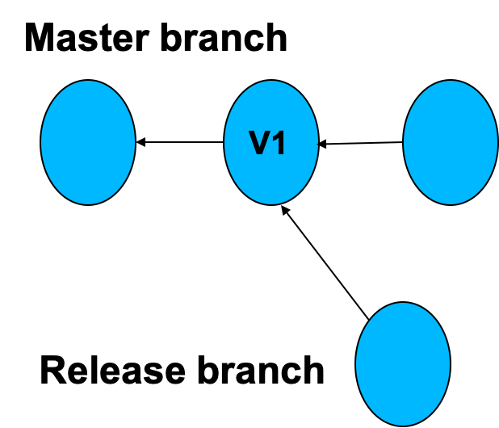

----

### Continue working ...

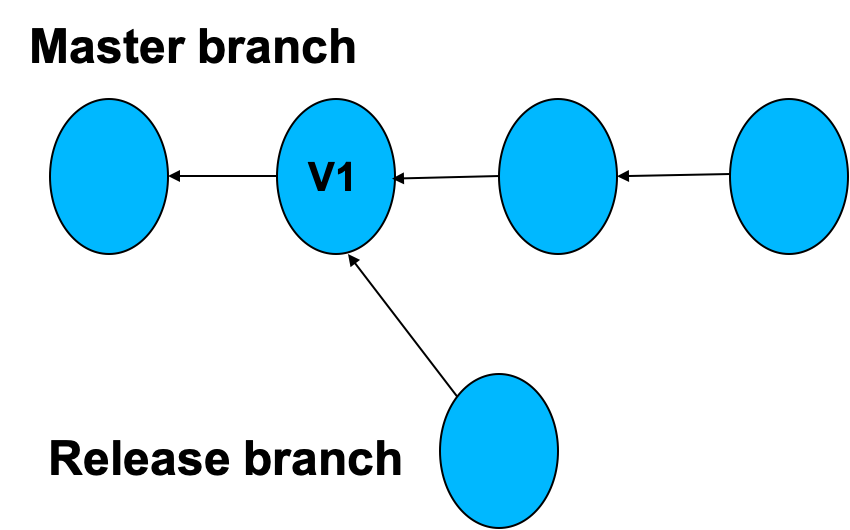

----

###  Bug Identifed also in the first release

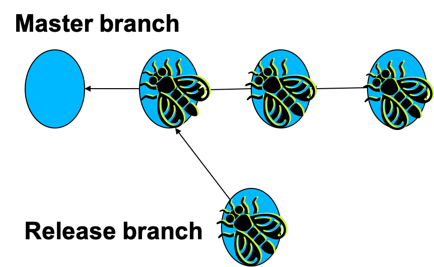

----

### Fix bug in release branch

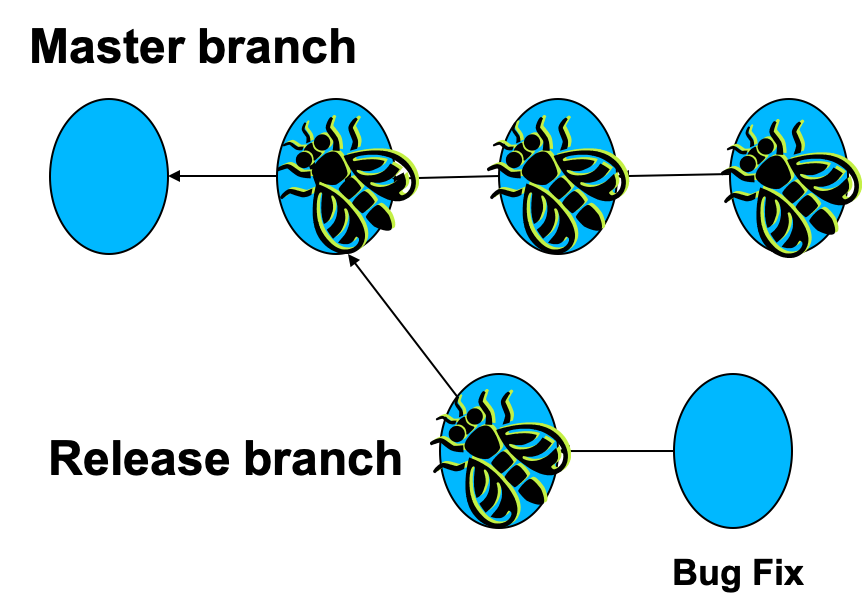

----

### Tag and release

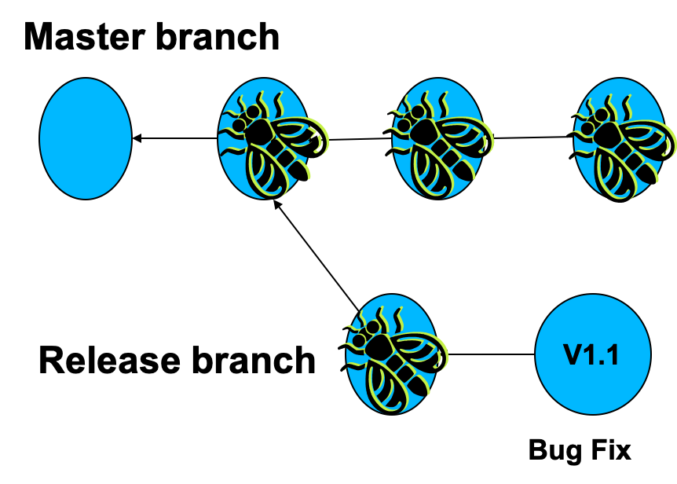

----

### Merge fix to the main branch

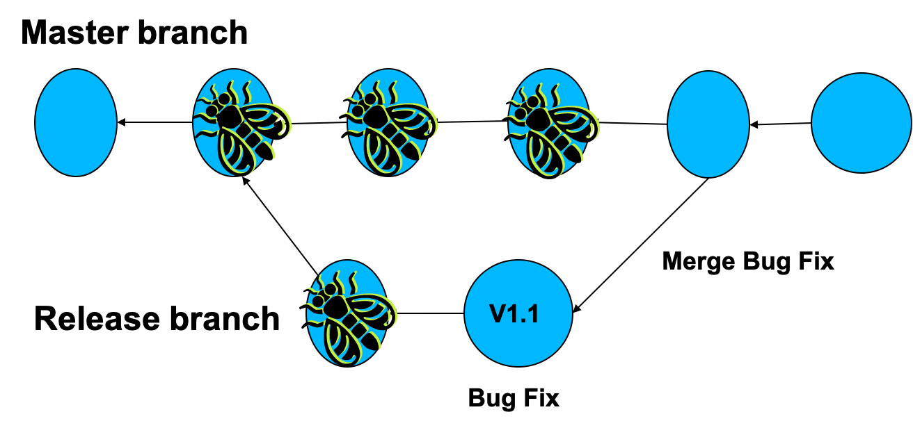

----

## Popular model

* A release branch, representing a released version of the code.

* A master branch, representing the most up-to-date stable version of the code.

* Various feature and/or developer-specific branches representing work-in-progress, new features, etc.

----

## Example

* Can have more complex topologies:

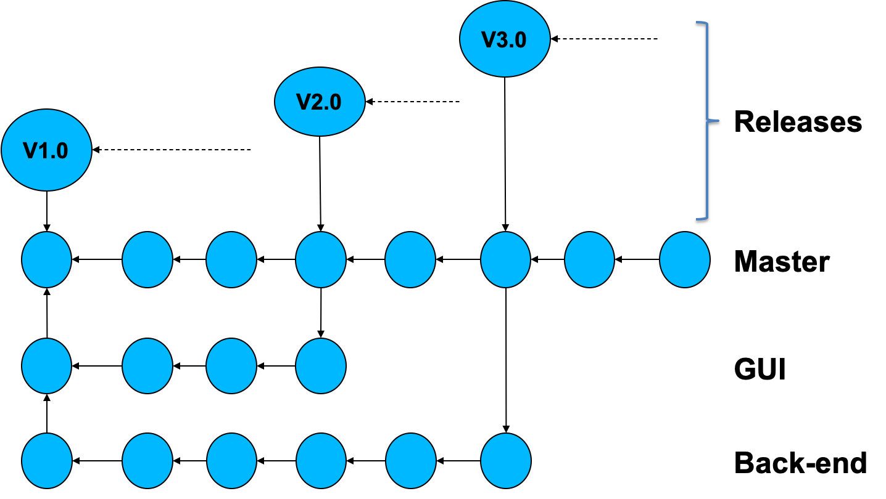

---

## Recap

What we have learnt:
* Know how to create remote repositories.
* Know how to clone repositories.
* Know how to push content to the repository.
* Know how to fetch and merge or pull content.
* Know how to resolve conflicts.

----

### **pull**ing content (fetch and merge)

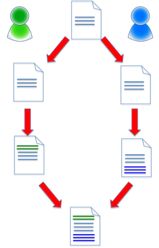

----

### Conflict

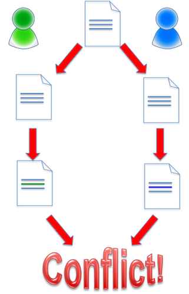

----

### More stuff

Not enough time to cover:

* Forking code
* For public repositories, LICENCE your code
   * Permissive: BSD, Apache, ...
   * Viral: GPL, ... 

----

### Cloning

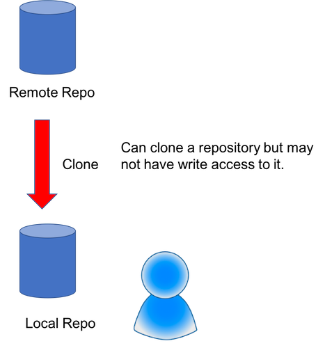

----

### Forking

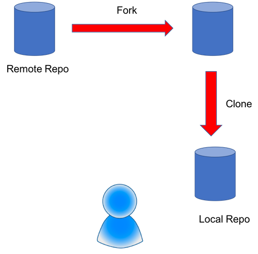

----

### Pull request

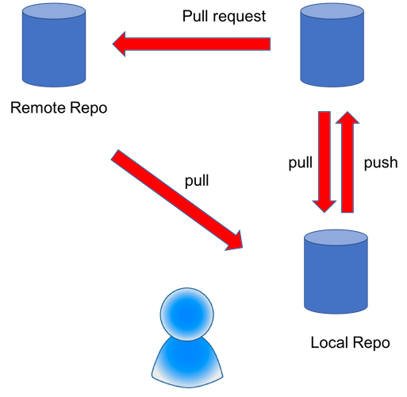

----

## Hopefully not

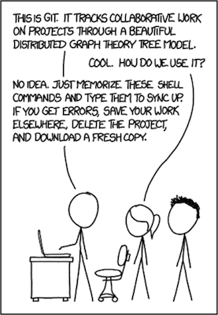<br/>

<small>
From: http://xkcd.com/1597/
</small>


---


## What do we now know

* Know how initialise a local repository
* How to add files
* How to commit files
* How to navigate between different versions
* How look at the file log
* How to tag files
* Know what a branch is

----

## Further information

* Visual Git Reference - pictorial representations of what Git commands do (http://marklodato.github.io/visual-git-guide/index-en.html).
* Pro Git - the "official" online Git book (http://git-scm.com/book)
* Version control by example - an acclaimed online book on version control by Eric Sink (http://www.ericsink.com/vcbe/index.html)

---

## End
